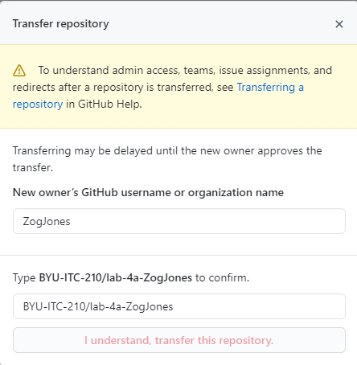

Shortly after the end of each semester we clear out all student labs from the [BYU ITC 210 Organization](https://github.com/BYU-ITC-210) on GitHub. We do this to avoid accumulating thousands of repositories from past students.

We hope that your labs were valuable enough that you will want to preserve them, either for future reference or for your professional portfolio. The best way to do this is to transfer your lab repositories (repos) from the BYU-ITC-210 organization to your own GitHub account.

Here is how to do that.

1. Browse to the repository on GitHub (e.g. https://github.com/BYU-ITC-210/lab-4a-ZogJones)
2. Select the **Settings** page (gear icon on the left end of the menu bar)
3. Scroll to the bottom of the settings page, to the section titled **"Danger Zone"**
4. Click the `Tranfer` button next to the **"Transfer Ownership"** title.
5. Under **"New owner's GitHub username or organization name"** type your username and type the full path to the repository to confirm.

    

6. Click, `"I understand, transfer this repository."`

For for information, see [Transferring a repository](https://docs.github.com/en/github/administering-a-repository/managing-repository-settings/transferring-a-repository) in the GitHub docs.