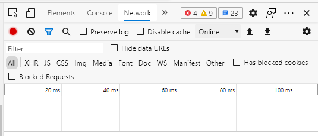

*50 points possible*

## Objectives

* Expose the nuts and bolts of HyperText Transport Protocol (HTTP).
* Gain experience with tools for troubleshooting network protocols.
* Learn problem-solving skills for web-based systems.
* Look under the hood of web services.

## Resources

* Computer with either Google Chrome or Microsoft Edge web browser. (You can use FireFox but the process of analyzing traffic is a little different).
* [RFC 2616](https://www.rfc-editor.org/info/rfc2616) The IETF standard that defines HTTP 1.1
* A [tutorial](http://www.steves-internet-guide.com/http-basics/) on how HTTP works.
* [Blank Answer Sheet](HW4-HTTP-Answersheet.txt){: download="HW4-HTTP-Answersheet.txt"} text file into which you will insert your answers.

## How to Complete and Submit the Homework
*Please follow these instructions*

1. Download the [answersheet](HW4-HTTP-Answersheet.txt){: download="HW4-HTTP-Answersheet.txt"} and load it into a text editor such as VS Code.
2. Perform each of the following steps. Write or paste your answers into the answer sheet.
3. Submit your answer sheet to LearningSuite for grading.

## Steps: Do the Following

### 1. Make an HTTP request

Get into your web browser's developer tools, select the Network tab, and start recording.

* Open your browser (Edge or Chrome)
* Open developer tools (upper-right menu ➜ More Tools ➜ Developer Tools, or F12, or right-click ➜ Inspect)
* Select the Network tab. (It may be hidden behind the `»` symbol.)
* Make sure the filter is set to `All`.
* Recording should start automatically. See that the dot at the left of the button bar is red (and not black).
* It should look like this:

### 2. View the general information

Browse to [https://itc.byu.edu](https://itc.byu.edu) and select the request for the page itself. Look in the `general` section of the report.

* The page may be in your cache if you've visited the site recently. To be sure to view the full HTTP transaction, click the clear button next to the record button (to clear your capture) and then refresh the page.
* The page request (for the HTML) should be the first one in the list. Its name should be "itc.byu.edu". Click on that name to view the detail. Then click on the `headers` tab to the right to view the request and response details.

What URL was requested?

Which request method (HTTP verb) was used?

What is the IP address of the server? (Remote address.)

Which port on the server was accessed?

Is the port the one you would expect it to be? Why?

### 3. View the request details

Click on "view source" next to `Request Headers` to see the raw HTTP request.

What version of the HTTP protocol is your browser using?

What is the host?

What "User-Agent" information does your browser send with the HTTP request?

Can your browser handle files from the server that have been gzip compressed? (Look in the <code>Accept-Encoding</code> header to find out.)

What is the preferred language for the user of this browser? (Hint: check the <code>Accept-Language</code> header.)

### 4. View the response  details

Click on "view source" next to `Response Headers` to see the raw HTTP response.

What status number did you receive?

Explain what the number means.

What type of server is BYU IT&C using?

What <code>Content-Type</code> is the response body in?

Did the server compress the response? (Hint: See the <code>Content-Encoding</code> header.)

### 5. Other request/responses

How many more requests does the browser make just to render this page (roughly)?

Do the resources come from the same or from different servers?

Does the page use any JavaScript? (Hint, use the filter buttons.)

Does the page use CSS? (Hint, use the filter buttons.)

Does it appear that the page has traffic analytics? Explain.

