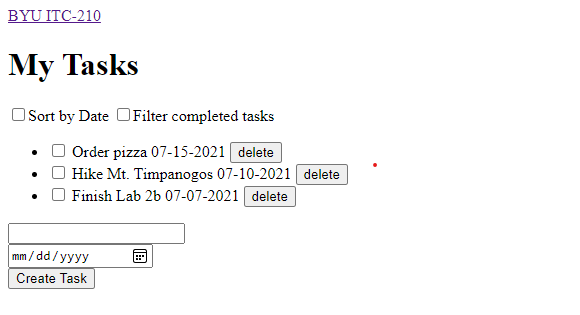
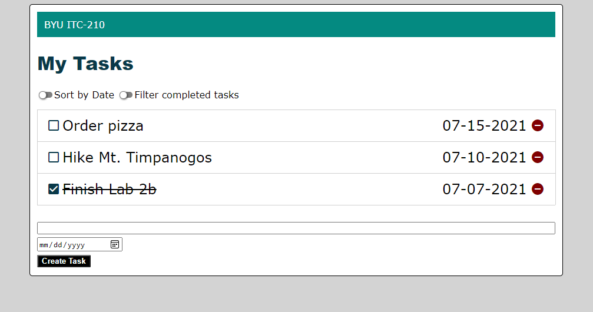

# Lab 1B - HTML & CSS

## Overview

In order to visualize content, most applications use some kind of markup language. Web browsers use HTML (**H**yper**T**ext **M**arkup **L**anguage) to organize the content on the screen, and CSS (**C**ascading **S**tyle **S**heets) to style the content. CSS is used to change things like font, colors, positioning, and even animations. JavaScript is used to execute logic on the website when it's needed.

A nice metaphor for these basic components is the human body. HTML defines what is on the website, much like the skeleton. CSS makes everything look pretty and hides all the ugly parts, much like the skin. JavaScript manipulates what is on the website, much like the muscles.

In this lab, you will create a tasklist webpage. Then you will apply a CSS stylesheet that we have pre-written. You will make some enhancements to the stylesheet so that the page looks just the way you want it to. Finally, you'll add some minimal javascript to make it respond to a user action.

This task list will serve as the basis for future labs for the rest of the semester.

The first few steps are written in great detail. Later steps link to appropriate references. In the last few steps we list the requirements and expect you to look up instructions for yourself.

## Functionality

- Structure your project
- Write correct HTML
- Apply CSS to your HTML
- Edit and update CSS
- Taste of JavaScript

## Concepts

- Project Structure
- HTML Syntax
- CSS Syntax
- CSS Variables
- CSS Frameworks
- Responsive app design
- JavaScript

## Technologies

- HTML
- CSS
- JavaScript

## Step 1: Set up your folder structure

A website is just a bunch of special files in one or more folders. You can create your website in any new folder, but in your case, you will want to use the `src` folder you created in Lab-1A.

Inside the `src` folder, if it's not already there, create the following, making folders as necessary:

- `src/index.html` (start with a blank file)
- `src/css/style.css` (copy the one from this lab)
- `src/js/script.js` (start with a blank file)

> Note: The Apache web server automatically looks for a file called `index.html` and uses it as the default starting point when someone tries to view your website. You can edit the config files to change what the default starting point is.

This is a good time to commit your changes to GitHub. Remember to *commit early and often.* That way you can revert changes if you mess up in a big way.

## Step 2: Create your skeleton

HTML files have a certain structure that you'll need to conform to if you want it to work properly. The top of every HTML file will tell you which version of HTML you are using.

1. Add the first line to `index.html`:

    ```html
    <!DOCTYPE html>
    ```

    > This "tag" tells the browser to use HTML version 5, the latest version. Without it, your page may not behave the way you expect it to.

1. Add an html element to contain your document:

    ```html
    <!DOCTYPE html>
    <html>

    </html>
    ```

    > You'll notice that this time you added two "tags". There is an opening and a closing tag. The *element* is the two tags and everything between. Some elements don't need a closing tag, and some elements close themselves. You can find more information on the [w3school documentation](https://www.w3schools.com/html/html_intro.asp).

    > Each HTML page has `<head>` and `<body>` elements. The head is not visible, so it's the right place to connect your HTML page with other files, including your styles. You can also give a name to your webpage with the `<title>` tag. The title will show on the corresponding tab in your browser.

    ```html
    <!DOCTYPE html>
    <html>

    <head>
      <title><!-- Add an appropriate name --></title>
      <!-- Links to stylesheets -->
    </head>

    <body>
      <!-- Your visible elements -->
      <!-- Links to scripts -->
    </body>

    </html>
    ```

    > A comment in HTML starts with `<!--` and ends with `-->`. As this lab progresses, you will replace the comments with real content.

    > You'll notice that the title element is nested in the head element. That's how HTML is organized. You'll also notice the indentation on tags that are nested in other tags. The browser doesn't care about indentation, but your co-workers will. Get into the habit of indenting.

For your task list application, create the following components using just HTML:

- A navigation bar ([&lt;nav&gt;](https://www.w3schools.com/tags/tag_nav.asp)) with at least one link ([&lt;a&gt;](https://www.w3schools.com/tags/tag_a.asp))
- A page title ([&lt;h1&gt;](https://www.w3schools.com/tags/tag_hn.asp))
- Two checkboxes ([&lt;input type='checkbox'/&gt;](https://www.w3schools.com/tags/att_input_type_checkbox.asp)), each with a label ([&lt;label for='id'&gt;](https://www.w3schools.com/tags/tag_label.asp)).
The labels should be "`Sort by date`" and "`Filter completed tasks`".
- An Unordered List ([&lt;ul&gt;](https://www.w3schools.com/tags/tag_ul.asp)) to contain the tasks:
    - At least two List Items ([&lt;li&gt;](https://www.w3schools.com/TAGS/tag_li.asp)) which each contain the following:
        - checkbox ([&lt;input type='checkbox'/&gt;](https://www.w3schools.com/tags/att_input_type_checkbox.asp))
        - A small bit of text ([&lt;span&gt;](https://www.w3schools.com/tags/tag_span.asp)) containing the task description.
        - A date ([&lt;span&gt;](https://www.w3schools.com/tags/tag_span.asp)) in the format `'MM-DD-YYYY'`
        - A button ([&lt;button&gt;](https://www.w3schools.com/TAGS/tag_button.asp)) with the text being `delete`
- An HTML [&lt;form&gt;](https://www.w3schools.com/html/html_forms.asp) that contains
    - A text input ([&lt;input type='text'/&gt;](https://www.w3schools.com/TAGS/att_input_type_text.asp))
    - A date input ([&lt;input type='date'/&gt;](https://www.w3schools.com/TAGS/att_input_type_date.asp))
    - A button ([&lt;button&gt;](https://www.w3schools.com/TAGS/tag_button.asp)) with the text being `Create Task`
    - A [name](https://www.w3schools.com/tags/att_name.asp) attribute for both inputs (e.g. 'description' and 'date')
    - The [required](https://www.w3schools.com/TAGS/att_required.asp) attribute for both inputs
    - Make sure each input and button in the form appears on its own line. (use [&lt;br/&gt;](https://www.w3schools.com/TAGS/tag_br.asp) or surround each control with [&lt;div&gt;](https://www.w3schools.com/TAGS/tag_div.asp) tags).

Once you have written this page, save it to `index.html` and open it in your browser. Make sure that clicking on the labels next to the `Sort` and `Filter` checkboxes causes the corresponding boxes to change. (The "[id](https://www.w3schools.com/htmL/html_id.asp)" attribute on each checkbox should match the "[for](https://www.w3schools.com/tags/att_label_for.asp)" attribute on each label.)

At this point, your page should look something like this (with different tasks, of course):



## Step 3: Add skin to the skeleton

No doubt you thought to yourself, this looks like a website made in the 90s. Well, that can be fixed with CSS!

There are lots of ways to get started on a CSS project. One common approach is to use a prebuilt framework like [Bootstrap](https://getbootstrap.com/), [Tailwind](https://tailwindcss.com/) or [Foundation](https://get.foundation/). Another strategy is to use a minimum, semantic style set as a starting point and build on it. Some examples are [Water.css](https://watercss.kognise.dev/), and [MVP.css](https://andybrewer.github.io/mvp/).

For this lab, we have provided a baseline CSS stylesheet, `style.css`, that you will edit and enhance to develop your own look. Your goal is to keep it simple and classy. Something like the example at the bottom of these instructions.

1. Copy the CSS `<link>` tag from sample below and paste it between the `<head>` tags. The [link tag](https://www.w3schools.com/tags/tag_link.asp) is used to connect a document to an external resource, in your case, a CSS stylesheet file.

    > These tags have **attributes** that indicate certain information. The `<link>` tag needs a `rel`, and an `href` attribute. `rel` means the "relation" the linked file has to the current page. In this case it will be `rel="stylesheet"`. `href` means "hypertext reference", and tells the browser where the other resource is located. In this case, it tells the HTML where to find your stylesheet.

    ```html
    <!DOCTYPE html>
    <html>
      <head>
      <!-- title, meta, etc -->
      <link rel="stylesheet" href="css/style.css">
    </head>
    <!-- body -->
    </html>
    ```

2. View your page. The style rules in `style.css` should have set a gray window background, a page border, a distinctive navigation bar, and custom fonts. Nevertheless, your tasks aren't lined up and the buttons are pretty clunky.

## Step 4: Apply classes

Open `style.css` in your editor. So far, only the style rules at the top have been applied. They use [element selectors](https://www.w3schools.com/cssref/sel_element.asp) like "`body`", "`h1`", and "`nav`". Rules like these apply to all elements with a matching name. The "`:root`" selector is a special case, it applies to the entire page at a level even above "`body`". Styles cascade to nested elements unless overridden at a lower level. So the font specified  in `:root` applies to the entire page unless overridden elsewhere.

The "`nav a`" selector is a [combined element selector](https://www.w3schools.com/cssref/css_selectors.asp). It selects all "`a`" elements that are nested inside the "`nav`" element. Thus it only overrides the look of links when they are in the navbar.

The next set of rules in `style.css` use [class selectors](https://www.w3schools.com/cssref/sel_class.asp). They take effect when the corresponding class name is applied to an element. You can apply the same class to multiple elements thereby giving them a consistent look.

1. Change the "`Sort`" and "`Filter`" checkboxes to look like toggle switches.

    * Set the class attribute on each checkbox to "`toggle-switch`" like this:

    ```html
    <input type='checkbox' class="toggle-switch" id="cb-sort"/><label for="cb-sort">Sort by date</label>
    ```

2. Make your list of tasks look more like a series of items (not a bulleted list) and line the elements up in columns (done checkbox, description, date, and delete button).

    * Apply the "`tasklist`" class to the `<ul>` element.
    * Apply the "`task`" class to each `<li>` element.
    * Apply the "`task-done`", "`task-description`", "`task-date`", and "`task-delete`" classes to the corresponding elements in each task in the list.

3. Change the *done* checkbox for each task to use custom icons.
    * Apply the "`checkbox-icon`" class to each "done" `<input type='checkbox'>` element.

    > Hint: The element will have two classes, "`task-done`" and `checkbox-icon`". When multiple classes are applied, you separate their names with spaces.
    
    ```html
     <input type=`checkbox` class='task-done checkbox-icon'/>
    ```

4. Change your delete buttons to icons.

    At the top of `style.css` is an "`@import`" statement that brings in the [Material Icons](https://fonts.google.com/icons?selected=Material+Icons+Outlined) font. When that font is applied, it substitutes icons for matching text.
    
    * Apply the "`material-icon`" class to your delete `button` elements (in addition to the "`task-delete`" class that's already there).

    * Change the text in the element from "delete" to the [name of the icon](https://fonts.google.com/icons) you wish to use. (Don't include a `<span>` or other features.)

    > Hint: Search the [Material Icons Directory](http://material.io/resources/icons) for the icon you want, select the icon, and find its name in the panel on the right. Try searching for [remove_circle](https://fonts.google.com/icons?icon.query=remove+circle) or [trash](https://fonts.google.com/icons?icon.query=trash).

At this point, the HTML is getting kind of repetitive. Every time you want to add a new item to your list, you have to copy and paste this HTML, and change every tag to have different IDs, text, classes... It's a lot of copying and pasting, and rule #1 when coding is that if you are doing a lot of copying and pasting, you're doing too much work (See [The DRY Principle](https://dzone.com/articles/software-design-principles-dry-and-kiss)). In the next lab you will fix this by using JavaScript to render the list for you.

## Step 5: Create new classes

The form section of your HTML will be used (in future labs) to create new tasks. The next step is to create some new style classes and apply them to customize the look of the form.

1. Create a style rule, with a class selector, and use it to make the description input fill the width of the form.

    > Remember: In the .css file, class selectors always start with a dot. (e.g. "`.my-description`") but in the HTML they use the "`class`" property without a dot (e.g. "`class='my-description'`").

    > Hints: Setting the "`width:`" CSS property to a percentage value makes its size relative to its parent. Also look at the "`box-sizing: border-box;`" property.

2. Create a style rule, with a class selector, and use it to make the "Create Task" button prettier.

    > Suggestions: You could change the background (`background-color:`) and foreground (`color:`) colors, change the border color or thickness (`border:`), make the text bold (`font-weight:`), round the corners (`border-radius:`), or do something else.

## Step 6: Customize the styles to make it yours

So far, your page is black and white and the fonts are generic. It's time to make your page more pleasing. Our goal is a classy and professional-looking website.

1. Use the [Material Color Tool](https://material.io/resources/color/), the [Coolors Tool](https://coolors.co) or another tool or site that you like to assemble a [color scheme](https://www.bing.com/search?q=color%20scheme).

    > Tip: The [W3Schools Colors Tutorial](https://www.w3schools.com/colors/default.asp) will tell you everything you might want to know about colors in HTML and CSS.

    > In CSS3, you can declare variables for use throughout the stylesheet. Variables are defined inside of a style rule using double dashes: `--`. Variables declared are only applicable to children of the selector they're declared in, which allows for sub-modulized control over styles. For your page, you'll use the `:root` selector to declare variables for the whole site. [Read more about CSS Variables here](https://developer.mozilla.org/en-US/docs/Web/CSS/Using_CSS_custom_properties)

2. In your `style.css` file, create variables for your new colors, and classes that use those colors.

    ```css
    :root {
      --primary: #ff0000;
      --accent: #00ff00;
      --delete: #0000ff;
    }
    ```

    > Note: While everyone has different opinions, and we won't mark you down for having a red navbar background and blue delete button, you should color this site in a way that makes you want to show it off to your potential employer in the future. Try and make it pretty.

3. Use these colors in the existing style rules or in new rules to color your website. The style rules could use element or class selectors.

    At a minimum, you should color the following with your custom rules: The navbar background, the checkbox foregrounds on each item, the delete buttons on each item, and the `'Create Task'` button for the form.

    > Note: If you use a dark color for the navbar background or the submit button background, you will also need to change the [font color](https://www.w3schools.com/cssref/pr_text_color.asp) for the same elements so you can still read them.

    Here's how to apply a color variable:

    ```css
    nav {
        background-color: var(--accent);
    }
    ```

    > Note: Four colors may or may not be enough for you in this site. If you need to, go ahead and make more color variables with appropriate names, and classes that apply them.

4. Mark one task as done.

    * Set the "[checked](https://www.w3schools.com/tags/att_input_checked.asp)" attribute on the `checkbox` for that task.
    * Create a rule with *class selector*, set "[text-decoration](https://www.w3schools.com/cssref/pr_text_text-decoration.asp) to "`line-through`" on that rule, and apply the class to the description `<span>` of that task.

5. Make at least three more customizations selected from the following list (see the tips that follow):

    * Put a [colored border](https://www.w3schools.com/css/css_border.asp) around each task.
    * Customize the window [background](https://www.w3schools.com/css/css_background.asp) with an image or texture.
    * Eliminate the visual distinction between the window background and the body while ensuring that the tasks and form don't get too wide on widescreen monitors.
    * Color the "`done`" checkbox green and the "`delete`" button red. Or use other colors of your choice that fit your color scheme and/or convey the purpose of each button.
    * Use a custom font in the title `<h1>`.
    * Make some space between the task list and the form. And/or put a border around the form.
    * Make the "`done`" checkbox change colors depending on whether it is checked or not.
    * Make the tasks exactly fit the width of the body and make the width of the "`description`" element responsive to changes to the width of the browser window.

    Tips:

    > Using "[box-shadow:](https://www.w3schools.com/CSSref/css3_pr_box-shadow.asp)" instead of "[border:](https://www.w3schools.com/CSSref/pr_border.asp)" may result in better-looking borders around your task list.

    > Use the "`:root`" *style rule* to change the background that surrounds the "`<body>`" element. Be sure to update the "`body`" style rule to reverse any changes in "`:root`" that you don't want to apply to the whole page.

    > Because the checkbox and delete button both use icon fonts, you can color them using the [color](https://www.w3schools.com/cssref/pr_text_color.asp) CSS property.
    
    > Consider [Google Fonts](https://fonts.google.com/) as a source of freely-licensed downloadable web fonts.

    > Look at the existing "`input.checkbox-icon:before`" and "`input.checkbox-icon:checked:before`" styles to see how the unchecked and checked looks of the "`done`" buttons are applied.
    
    > The "`style.css`" we provided uses [inline-block](https://www.w3schools.com/Css/css_inline-block.asp) to lay out the tasks. As part of this, the "`.task-description`" style rule uses [width: calc()](https://www.w3schools.com/cssref/func_calc.asp)" to adapt its width relative to the body. It works well but it's difficult/impossible to exactly match the parent width this way. Options to get an exact match are to [eliminate spaces between inline-block elements](https://iamsteve.me/blog/entry/inline_block), use [flexbox](https://www.w3schools.com/csS/css3_flexbox.asp), use [grid](https://www.w3schools.com/css/css_grid.asp), or use an html [table](https://www.w3schools.com/html/html_tables.asp).
    
## Step 7: Use JavaScript to activate a button.

In Lab 2, we'll use JavaScript to make your task list fully functional. Here, we are just dipping our toes in the water.

1. Open "`src/js/script.js`" that you created in Step 1 and insert the following code:

    ```javascript
    function on_create_clicked(event) {
        let formData = new FormData(event.currentTarget.parentElement);
        let json = JSON.stringify(Object.fromEntries(formData));
        alert(json);
        event.preventDefault();
    }
    ```

2. Reference your JavaScript file from your HTML page by adding this at the bottom of the "`<body>`" element.

    ```html
        <script src="js/script.js"></script>
    </body>
    </html>
    ```

3. Add the "`onclick`" event attribute to your "Create Task" button.

    ```html
    <button onclick='on_create_clicked(event)'>Create Task</button>
    ```

    Refresh your page, fill in the task form and click "Create Task". You should see an alert box with the contents of your form in JSON format.

    > Note: Each `<input>` control in your form must have a "`name`" attribute for the value to appear in the alert.

## Step 8: Set up your Production Environment

Follow [these instructions](https://gist.github.com/210TAs/660cd61f0210fdd0645be91ecc58969b) on setting up your live server.

# Tips

1. If your buttons, checkboxes, or dates are not aligned and you can't figure out why, it might be that you have an extra opening tag somewhere, bumping everything over.

2. If your style rules or JavaScript aren't working it may be because the files are in the wrong places or the paths are incorrect. In this lab we have used *relative paths* from `index.html` to the other files. Look back at Step 1 and make sure your files are in the specified locations relative to each other.

3. Curious about how the [Material Icons](https://fonts.google.com/icons) font turns words like "trash" or "home" into corresponding icons? It is a [Ligature Icon Font](http://thenewcode.com/620/Why-You-Should-Consider-A-Ligature-Icon-Font-For-Your-Next-Project).

# Example



# Pass-off

## Dev Server Requirements

- [ ] Your site has a navigation bar, and a list of tasks with all of the necessary UI elements (a checkbox, the text of the task, due date, and a delete button)
- [ ] Your site has no default HTML styles visible (no ugly elements). See Style Rules below.
- [ ] Your site is backed up in an online git repository

## Live Server Requirements (if your live server has been set up)

- [ ] Your site works on your live server
- [ ] Live server page brings up `index.html` without any extra path in the URL
- [ ] Live server has directory listing disabled
- [ ] Stop and Restart Apache server
- [ ] Open the Apache error log and review contents

## Style Rules

- [ ] Your site DOES NOT use the default black and white color scheme
- [ ] Navbar is at the top of the page
- [ ] On all tasks, buttons, checkboxes, and dates are aligned vertically
- [ ] Task text (description) is left-aligned, and left-hand side is aligned vertically
- [ ] Due date is not right next to task text
- [ ] No default HTML check-boxes or buttons
- [ ] No inline style attributes in HTML

## Extra Credit
> Note: TAs cannot help you with extra credit!

- [ ] 10 Points - Use a style framework such as [Bootstrap](https://getbootstrap.com/), [Tailwind](https://tailwindcss.com/), [Foundation](https://get.foundation/), [Water.css](https://watercss.kognise.dev/), [MVP.css](https://andybrewer.github.io/mvp/) or similar.
- [ ] 10 Points - Site is fully responsive and looks equally good on a PC and on a phone. (Note: Responsive design principles are addressed later in this course.)

# Writeup Questions

- What is the difference between a CSS rule with an *element* selector and one with a *class* selector? When would you use each?
- What are the advantages of putting your styles in a separate .css stylesheet instead of in the `<style>` element of `<head>`?
- How do web browsers choose which CSS to use for an HTML element when the CSS rules contradict each other?
- Why should you disable directory access for your server?

