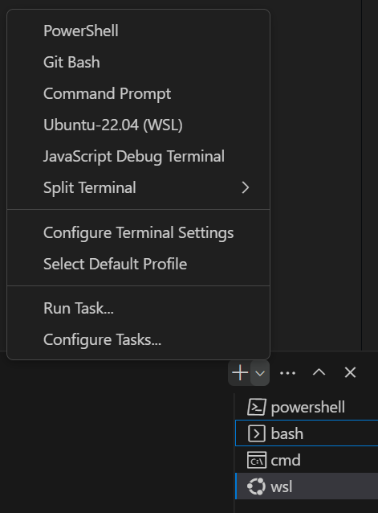
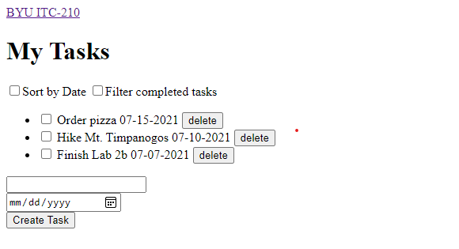
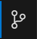
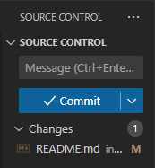

### Overview

Before you start building your application, you need an environment on your computer that makes it easy to see your app as you develop it.

With basic HTML, CSS, and JavaScript, you can just open the files in your browser by dragging the HTML page into an open browser window.

However, soon you'll be developing in PHP, C#, and frameworks such as Node.js and React, so you'll want a better solution because you can't just open those files in a browser.

### Functionality

- Setup development environment
- Setup production environment
- Serve a web page

### Concepts

- Development vs Production Environments
- Configurations with web servers
- Working with Linux servers
- Working with Remote Servers

### Technologies

- Docker
- HTML
- Linux
- Apache

## Step 1: Install and Prepare Your Development Environment

If you have not done so already:
* Follow these instructions to [Install Visual Studio Code and Git](/InstallCodeAndGit){:target="_blank"}
* If you use Windows, follow these instructions to [Install WSL2 and Docker](/InstallWsl2AndDocker){:target="_blank"}
* If you use a Mac, follow these instructions to [Install Docker](https://docs.docker.com/docker-for-mac/install/){:target="_blank"}

## Step 2: Set up your project

To see your project running, you need to _serve_ it. We'll be downloading a static file server called Apache, via a Container that's managed by Docker. (DO NOT download Apache. All you need is the Docker Container.) You can use the `httpd` official Apache docker image. Apache is a static file server. Below are instructions for using it.

1. Clone your repository to your computer, and open the folder in VSCode.

    > Note: This repository that you are cloning from is also the repository that you will push your code to when you push to GitHub. Make sure that it is the repository we give you that starts has the path/name `BYU-ITC-210/lab1a-<your GitHub username>`. 

    > Warning: If you create GitHub repositories on your own personal account, we will not be able to see them and grade the write ups you will put there in future labs.

2. Create a new folder called `src` in the project root directory. Inside the `src` folder, create two more folders, called `css` and `js`. 

    - The `src` folder is where your project files will go. Any HTML, CSS, and JavaScript should be here.
    - In the `css` folder, create a file called `style.css`. In the `js` folder, create a file called `script.js`. You do not have to put anything in these files in this lab, but in future labs, we will use a similar file structure. 
    - Back in the `src` folder, make a file called `index.html` and paste the following into that file:

    ```html
    <!DOCTYPE html>
    <html lang="en">

    <head>
      <meta charset="utf-8" />
      <meta name="viewport" content="width=device-width, initial-scale=1.0" />
      <!-- Add an appropriate title in this tag -->
      <title></title>
      <!-- Links to stylesheets -->
    </head>

    <body>
      <!-- Your visible elements -->
      <!-- Links to scripts -->
    </body>

    </html>
    ```

    > Note: The `<title>` inside the `<head>` is a special element. Browsers will take the content here and stick it on the tab at the top of the browser. We'll be able to see this once we have Docker serving our files.

3. Create a new file called `docker-compose.yml` in the root of the project (i.e. NOT inside the new `src` folder) and paste in the following:

    ```yml
    web:
        image: httpd
        container_name: it210_lab_1_apache
        ports:
            - 80:80
        volumes:
            - ./src:/usr/local/apache2/htdocs
    ```

    > Explanation: `docker-compose` is a tool that allows us to give settings to a docker image before running it.

    *Here, we're telling Docker that it will create a container using the `httpd` image, and call it `it210_2_apache`. It forwards any connections on port `80` of your computer to port `80` on your container. The first number is your computer's port, and the second number is the port on the container. Apache is already set to listen on port 80, which is the default HTTP port, and we'll see our website soon by going to http://localhost:80/, or simply http://localhost/ but if you were running multiple servers, you could see them all by associating them with different ports by changing the first number (e.g. `1000:80` could be seen on http://localhost:1000/ in your browser). Then we tell Docker to mount the `src` folder we created to the `/usr/local/apache2/htdocs` folder on the image. When we make updates to these files on our local machine, we will be able to see those changes immediately.*

4. Press <kbd>Ctrl-`</kbd> in Visual Studio Code to open the integrated terminal

    - The default on Windows machines is PowerShell, but if you have the Windows Subsystem for Linux and you've downloaded Ubuntu from the Microsoft Store, you can use that as your integrated terminal, or you can even use the Git Bash, which some people look down on, but others think it's great. For Macs, this will open a normal terminal within your editor.

    > This is what the the terminal looks like in VScode. Using the drop down arrow, you can see and select which terminal you want to use. 
    

5. To start the server, run the following command:

    ```sh
    docker-compose up -d
    ```

    > Note: If running docker on Windows, make sure to run this command from the Linux command line, NOT from Command Prompt (aka CMD). If the error "(root) Additional property web is not allowed" occurs, this is likely the issue. If the error persists even in the Linux command line, run the command as a [sudo user]().

6. You can see the running server in the Docker tab in VSCode under Containers

7. Open a web browser to http://localhost/ and see your website!

8. To take down the server, run the following command:

    ```sh
    docker-compose down
    ```
    > Your container will keep running and use resources until this command is run. 

## Step 3: Create a Plain HTML Task List Application

In this step, we will create a plain HTML Task List. It will have the controls for the app but it won't function and won't be very pretty. Future labs will make it look good and function.

A comment in HTML starts with `<!--` and ends with `-->`. As the labs progress, you will replace the comments with real content.

The source code to your index.html page should currently look something like this.

```html
<!DOCTYPE html>
<html lang="en">

<head>
  <meta charset="utf-8" />
  <meta name="viewport" content="width=device-width, initial-scale=1.0" />
  <!-- Add an appropriate title in this tag -->
  <title></title>
  <!-- Links to stylesheets -->
</head>

<body>
  <!-- Your visible elements -->
  <!-- Links to scripts -->
</body>

</html>
```

The `<html>` start tag marks the beginning of the page and the `</html>` *end tag* marks the end of the page. An HTML *element* is composed of a *start tag*, a matching *end tag* and everything between.

Each HTML page has `<head>` and `<body>` elements. The head is not visible, so it's the right place for metadata, and references to other files such as stylesheets. You also give a name to your webpage with the `<title>` tag. The title will show on the corresponding tab in your browser.

> You'll notice that the title element is nested in the head element. That's how HTML is organized. You'll also notice the indentation on tags that are nested in other tags. The browser doesn't care about indentation, but your co-workers will. Get into the habit of indenting.

For your task list application, create the following components using just HTML:

- A navigation bar ([&lt;nav&gt;](https://www.w3schools.com/tags/tag_nav.asp)) with at least one link ([&lt;a&gt;](https://www.w3schools.com/tags/tag_a.asp))
- A page title ([&lt;h1&gt;](https://www.w3schools.com/tags/tag_hn.asp))
- Two checkboxes ([&lt;input type='checkbox'/&gt;](https://www.w3schools.com/tags/att_input_type_checkbox.asp)), each with a label ([&lt;label for='id'&gt;](https://www.w3schools.com/tags/tag_label.asp)).
The labels should be "`Sort by date`" and "`Filter completed tasks`".
- An Unordered List ([&lt;ul&gt;](https://www.w3schools.com/tags/tag_ul.asp)) to contain the tasks:
    - At least two List Items ([&lt;li&gt;](https://www.w3schools.com/TAGS/tag_li.asp)) which each contain the following:
        - checkbox ([&lt;input type='checkbox'/&gt;](https://www.w3schools.com/tags/att_input_type_checkbox.asp))
        - A small bit of text ([&lt;span&gt;](https://www.w3schools.com/tags/tag_span.asp)) containing the task description.
        - A date ([&lt;span&gt;](https://www.w3schools.com/tags/tag_span.asp)) in the format `'MM-DD-YYYY'`
        - A button with text `delete` between the tags
- An HTML [&lt;form&gt;](https://www.w3schools.com/html/html_forms.asp) that contains
    - A text input ([&lt;input type='text'/&gt;](https://www.w3schools.com/TAGS/att_input_type_text.asp))
    - A date input ([&lt;input type='date'/&gt;](https://www.w3schools.com/TAGS/att_input_type_date.asp))
    - A button ([&lt;button&gt;](https://www.w3schools.com/TAGS/tag_button.asp)) with the text being `Create Task`
    - A [name](https://www.w3schools.com/tags/att_name.asp) attribute for both inputs (e.g. 'description' and 'date')
    - The [required](https://www.w3schools.com/TAGS/att_required.asp) attribute for both inputs
    - Make sure each input and button in the form appears on its own line. (use [&lt;br/&gt;](https://www.w3schools.com/TAGS/tag_br.asp) or surround each control with [&lt;div&gt;](https://www.w3schools.com/TAGS/tag_div.asp) tags).

At this point, your page should look something like this (with different tasks, of course):



That's pretty plain-looking. In Lab 1B we will give it a CSS makeover!

## Step 4: Add a favicon

Let's take a second and get familiar with the most indispensable tool for web development: the inspector. The inspector shows the Document Object Model (DOM) as the browser sees it. You also get the browser console, which will tell you of any JavaScript errors. In later labs, we'll learn how to inspect local storage, cookies, Vue resources, and more. What we're going to look at right now is the Networks tab.

1. Open the inspector (<kbd>Ctrl-Shift-i</kbd> / <kbd>Cmd-Opt-i</kbd>)
2. Open the Networks tab (you may need to hit the <kbd>>></kbd> button if your screen is small)
3. Perform a hard refresh (<kbd>Ctrl-Shift-r</kbd> / <kbd>Cmd-Shift-r</kbd>)
4. Note the red/purple resource, `favicon.ico`, which has code 404 Not Found. The browser automatically looks for this resource on a hard refresh, but may not look for it again on a normal refresh (<kbd>Ctrl-r</kbd> / <kbd>Cmd-r</kbd>).

With this in mind, find or create an icon image, and stick it in your `src` folder, right next to your `index.html`. Name it `favicon.ico`. It should automatically load on a hard refresh now (200 instead of 404 in the Networks tab), and you should be able to see it in the tab bar next to where the title is displayed.

> Hint: Searches for "favicon", "favicon generator", or "free favicon" will help you find something to use on your site.

## Step 5: Commit and Push to GitHub

You now have one place (a folder on your computer) where your code lives. Eventually, there will be 3:

1. Your Development Environment (your personal computer or a lab computer)

2. GitHub (history of all changes and a place to collaborate with team members)

3. Your Production Environment (a server in the cloud)

You created the repo on GitHub already (the BYU-ITC-210 repo), and should see the status and any changes you made in the Source Control tab on the left edge of the VSCode window. 

 

VSCode knows how to keep track of changes because of a `.git` directory inside your project root folder. If you can't see the `.git` folder, it may be because by default most operating systems hide files and folders with names that begin with a period.



> Use Google to find out how to show hidden files and folders on your device in the linux terminal.

The root of our project is where you find the `docker-compose.yml` and the `src` folder.

We've created some files and folders inside our project, and you should see them appear in the Source Control tab, under the section __CHANGES__. Hit the <kbd>+</kbd> next to each new file, which automatically calls `git add` on that file. Now, hit the check at the top of the tab, which calls `git commit`. It will prompt you for a message. Take a second and give it a useful name, for example: `'add new files'`. Next, inside the three-dot menu at the top of the tab, click `Push`. This calls `git push`, and after verifying that you are a GitHub user with appropriate permissions on this repository, if you go back to GitHub, you'll see all of the code you wrote stored in the cloud!

If you are a linux terminal extremist then you can use the following commands instead. Assuming that you are in the root directory of your project:
```
git add .
git commit -m "<insert commit message here>"
git push
```

## Step 6: Set up your Production Environment

Follow [these instructions](https://byu-itc-210.github.io/AWS-Server-Setup) on setting up your live server.

# Tips

## If you do not understand something or you aren't getting the results that you want, ***google it!!!***
### `The current user must be in the 'docker-users' group to use Docker Desktop.` 

When multiple people use the same lab computer, then each user must be added to the `docker-users` group. Windows has good documentation about how you can add yourself to the `docker-users` group which can be found [Here](https://docs.microsoft.com/en-us/visualstudio/containers/troubleshooting-docker-errors?view=vs-2019#docker-users-group).

# Passoff Rubric

- [ ] 5 points - First commit is on or before Friday
- [ ] 8 points - Application is deployed to a live cloud server
- [ ] 4 points - Source code is pushed to GitHub
- [ ] 4 points - Live server shows contents of `index.html` when the URL path is empty
- [ ] 5 points - Page has good title
- [ ] 8 points - Page has a navbar with at least one link
- [ ] 8 points - Page has at least two tasks in a list. Each of which has a checkbox, a date, and a delete button
- [ ] 6 points - Page has a form with boxes for entering a new task name, date and a button to save
- [ ] 4 points - Page has a favicon and title in the browser tab
- [ ] 5 points - Live server has directory listing disabled
- [ ] 4 points - Open the Apache error log and review contents
- [ ] 4 points - Stop and restart the Apache server

> While your page has a bunch of buttons, checkboxes, and such, none of them will do anything until Lab 2.

# Writeup Questions

(For the Lab 1 writeup due later)
No UML is required in the Lab 1 writeup.

- What is the purpose of using Docker containers?
- Why is it useful to have both a development environment and a live server environment?
- What is the purpose of using a code versioning tool (i.e. Git)?
