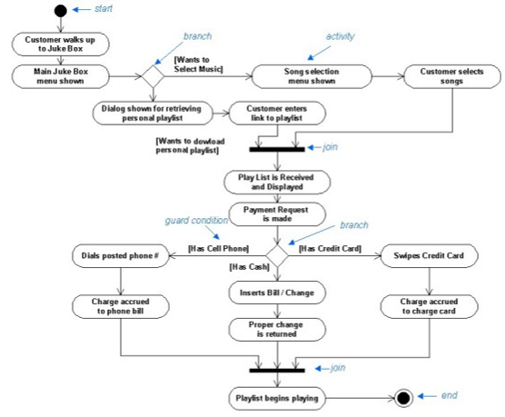
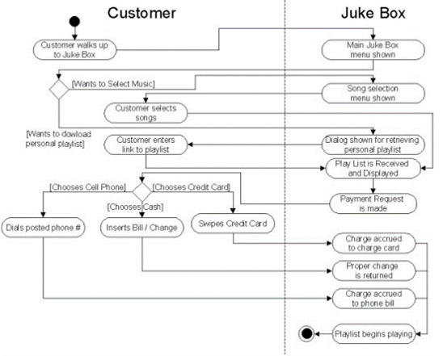
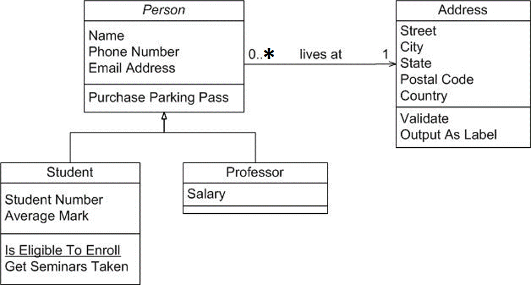
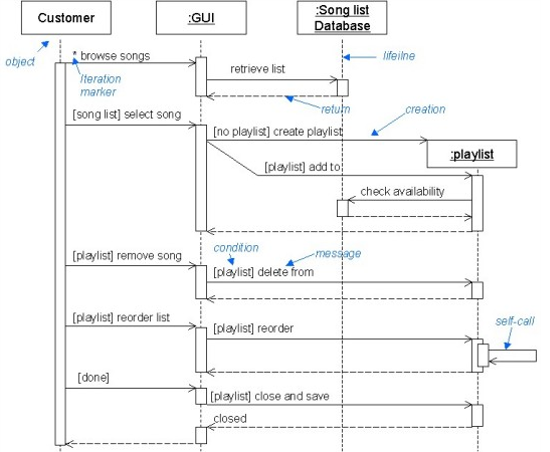

[Unified Modeling Language (UML)](https://en.wikipedia.org/wiki/Unified_Modeling_Language) is a standard notation for diagrams used primarily for software design. It is an approved [ISO Standard](https://www.iso.org/). In IT&C 210A we use UML Activity diagrams. In IT&C 210B we will add UML Sequence Diagrams.

For this class, you can create your UML diagrams using the graphical tool of your choice. Microsoft PowerPoint and Visio have some UML symbols built-in. [LucidChart](https://www.lucidchart.com/) has specific support for UML diagrams of various sorts. [DrawIo](https://www.drawio.com/) is another good choice. Regardless of source, you should generate an image file in .png, .svg, or .jpeg format to include with your writeup.

## UML Activity Diagrams
UML Activity Diagrams are also known as *Flow Charts*. They describe a sequence of operations typically performed by a computer or system of computers. Here is an example:

{: style="padding: 1em; border: 1px solid black; max-width: 100%;"}

An activity diagram may have *partitions*, also known as *swim lanes*. An activity diagram with partitions tends to have a lot of horizontal lines that show the handoff of control between different parts of the system.

{: style="padding: 1em; border: 1px solid black; max-width: 100%;"}

Here is a good [Activity Diagram Tutorial](https://www.lucidchart.com/pages/uml-activity-diagram).

## UML Class Diagrams
UML Class Diagrams are like Entity-Relationship Diagrams (ERD) used in data modeling with the enhancement that Class Diagrams can represent inheritance and can include methods in addition to data elements. It is not necessary for your Class Diagrams to include inheritance or methods.

Class Diagrams represent entities such as records in a database. They show the properties (a.k.a "fields") within those entities. And they show the relationships between entities.

Here is a simple example that *does* include both methods and inheritance:

{: style="padding: 1em; border: 1px solid black; max-width: 100%;"}

Here is a good [Class Diagram Tutorial](https://www.lucidchart.com/pages/uml-class-diagram).

## UML Sequence Diagrams

A UML Sequence Diagram shows a series of messages passed between *actors* in a system. They are particularly useful to describe protocols where servers communicate between each other.

Here is an example of a sequence diagram:

{: style="padding: 1em; border: 1px solid black; max-width: 100%;"}

And here is a [Sequence Diagram Tutorial](https://www.lucidchart.com/pages/uml-sequence-diagram).
