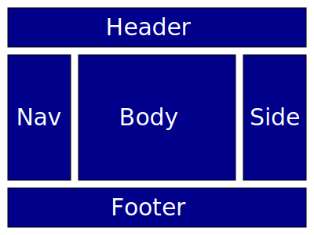

The Five Box Layout, known by many different names, is frequently used on websites. It consists of a header, three columns, and a footer. In this walkthrough we will learn four ways to produce this layout in CSS. While you may not always be seeking a five box layout, the CSS methods discussed here are useful in many other contexts.



## Setup

Download the [FiveBox.html](FiveBox.html){: download="FiveBox.html"} file and save it in an empty folder. We will apply styles to this basic template to achieve the Five Box layout.

Here is a simplified version of the template.

```html
<html>
    <body>
        <header>
            Header
        </header>
        <main>
            <nav>
                Nav
            </nav>
            <main>
                Main
            </main>
            <aside>
                Aside
            </aside>
        </main>
        <footer>
            Footer
        </footer>
    </body>
<main>
```
You can see how the structure starts with a `<header>`, the three middle columns are embedded in the `<main>` element, and the `<footer>` brings up the end. In each case we are using semantic tags.

The real template file includes labels on each box, some sample content to fill out each part, and borders on the boxes to show how they all fit together.

Open the file in a browser and see how the parts all stack up when there isn't a stylesheet involved.

## Method 1: Position

In the first method, we will use positioning to place each box. Save the following to a file called "position.css."

`position.css`
```css
main {
    /* Make main relative, not static so that 'absolutely' positioned children will be relative to its anchor. */
    position: relative;
}

nav {
    position: absolute;
    width: 15rem;
}

article {
    position: absolute;
    left: 16rem;
    width: 30rem;
}

aside {
    position: absolute;
    left: 47rem;
    width: 15rem;
}

footer {
    /* Locate this at the bottom of the browser window */
    position: fixed;
    top: 41rem;
    width: 100%;
}

```

To the `<head>` element of your HTML page add the following:
```html
<link rel="stylesheet" href="position.css">
```

Now refresh the page and see how it looks.

Absolute positioning like this works. But it is not sensitive to the length of the content or to the size of the window. Try changing the size of your browser or zooming in and out. The relative position of everything stays the same but if you zoom in, stuff goes off the screen. And imagine if the text in the `<article>` section got longer, then the position of the footer would be wrong.

So, while this works, it breaks easily.

## Advanced Position

We can take advantage of some advanced CSS features to make `position` work better. Change your stylesheet to the following:

```css
main {
    /* Make main relative, not static so that 'absolutely' positioned children will be relative to its anchor. */
    position: relative;
}

nav {
    position: absolute;
    width: calc(25% - 1rem);
}

article {
    position: absolute;
    left: 25%;
    width: calc(50% - 1rem);
    max-height: calc(100vh - 12rem);
    overflow-y: auto;
}

aside {
    position: absolute;
    left: 75%;
    width: calc(25% - 1rem);
}

footer {
    /* Locate this at the bottom of the browser window */
    position: fixed;
    bottom: 0;
    width: 100%;
}
```

Refresh the page and see how it looks. Resize the window, zoom in and out. Everything seems to adjust and work just how you would like. Let's look at the tools we used to make this happen.

The `%` unit is 1/100 the height or width of the enclosing element. The `calc()` function in CSS allows a value to be calculated. Conveniently, `calc()` lets us mix units. Let's see how these and other features are applied in the `article` rule:

* `left: 25%;` This sets the left edge at 25% of the size of the parent. Since a horizontal value is being set, then `25%` means one fourth the width of the parent. The parent is `<main>` which spans the width of the window.
* `width: calc(50% - 1rem);` We start with 50% of the parent element's width. The inline styles add `0.5rem` padding to each of the main five boxes and we need to compensate for that. Half of a `rem` on each side totals to `1rem` so we subtract that from the `50%`to arrive at the width to set.
* `max-height: calc(100vh - 12rem)`: Here we're using the `vh` unit which you might not have seen before. One `vh` is 1/100 of the vertical size of the window. So, now we take the vertical height and subtract a rough estimate of the height of the header and footer. To make things work even better, we might fix the heights of those elements. (Note that there is a corresponding `vw` unit which is 1/100 of the width of the window.)
* `overflow-y: scroll;` This property controls how the element behaves if there's too much content in the vertical dimension. `scroll` indicates that a scrollbar should be present so that you can scroll to see any hidden contents. Setting the value to `auto` will only make the scrollbar appear when content does overflow the element.

Also, notice the `<footer>` style. Instead of setting the `top` property we set `bottom: 0;`. That setting, in combination with `position: fixed;` anchors the footer at the bottom of the window.

The impressive thing is that units like `vh` and `%` change when you zoom or change the size of the window. So, when you resize, the browser automatically recalculates the values of anything with these units or with a `calc()` that uses them. You can see this happen by resizing the browser window and watching everything adjust.

## Method 2: Inline-Block

This approach lets the browser handle handle more of the layout calculation instead of having to build that math into the CSS. The `display: inline-block;` setting is a hybrid between `display: block;` and `display:inline;` From the outside, `inline-block` behaves like an inline element. That is, it stacks horizontally and wraps. From the inside, `inline-block` behaves like a `block` element. That is, the block fills a rectangular space and the text inside it wraps.

Nevertheless, for `inline-block` to work effectively, you have to set a width on the element. So there's still a little calculation involved.

Create a new stylesheet called "inline-block.css":

`inline-block.css`
```css
nav {
    vertical-align: top;
    display: inline-block;
    width: calc(25% - 1rem);
}

article {
    vertical-align: top;
    display: inline-block;
    width: calc(50% - 1rem - 2.5ch);
}

aside {
    vertical-align: top;
    display: inline-block;
    width: calc(25% - 1rem);
}
```

In the `<head>` of your HTML page, change it to use this new stylesheet:
```html
<link rel="stylesheet" href="inline-block.css">
```

You'll notice that there are spaces between the columns and the stylesheet compensates for this by subtracting 2.5ch from the width of `<article>`. Why is that?

The HTML parser treats all sequences of whitespace characters as a single space. Whitespace characters are space, tab `\t`, linefeed `\n`, and return `\r`. In the original HTML there is a line break between `<nav>` and `<article>` and another between `<article>` and `<aside>`. Those line breaks result in the spaces you see between the columns.

You can fix the space problem by editing the HTML to put no breaks between the elements. But that violates the principle of keeping design in the CSS and the content in the HTML. There are many articles [like this one](https://css-tricks.com/fighting-the-space-between-inline-block-elements/) that describe workarounds like setting font size to zero, but they are all pretty kludgey. That lead to people calling on the CSS standards folks to create some kind of `suppress-spaces` property. Instead, they invented [flexbox](https://www.w3schools.com/csS/css3_flexbox.asp) which does that and a lot more.

## Method 3: Flexbox

[Flexbox](https://www.w3schools.com/css/css3_flexbox.asp) is a more advanced form of the same method you used with `inline-block`. Create a new stylesheet called "flexbox.css":

`flexbox.css`
```css
main {
    display: flex;
}
```

Change your page to use the new stylesheet:
```html
<link rel="stylesheet" href="flexbox.css">
```

Well, that was simple! Only one rule with one property and you get a five box layout with everything adjusted to match the size of the content! Try zooming and changing the size of the window to see how everything fits.

But perhaps you want a little more control over the size of things. For example, you want the two sidebars to be the same width. And if the screen gets too narrow, the columns should stack vertically.

Update "flexbox.css" as follows:
```css
main {
    display: flex;
    flex-wrap: wrap;
}

nav, aside {
    min-width: 10em;
    flex-basis: 10em;
    flex-grow: 1;
}

article {
    min-width: 20em;
    flex-basis: 20em;
    flex-grow: 2;
}
```

The `min-width` and `flex-basis` values set the minimum and beginning values for the width respectively. `flex-grow` indicates how rapidly the size of the element will grow relative to others in order to fill the available space. The settings here make `<nav>` and `<aside>` the same width and `<article>` twice as wide. Experiment with changing the size of the browser window and you'll see that `flex-wrap` causes the columns to wrap around and stack vertically if the window is too narrow for the `min-width` values.

For more details, check out [this Flexbox tutorial](https://www.w3schools.com/css/css3_flexbox.asp). Flexbox is one of the best ways to achieve a [responsive design](https://developer.mozilla.org/en-US/docs/Learn/CSS/CSS_layout/Responsive_Design);

## Method 4: Grid

[Grid layout](https://www.w3schools.com/css/css_grid.asp) is the basis of many CSS frameworks such as [Bootstrap](https://getbootstrap.com/). In a grid, you lay out rows and columns and then assign elements to locations within the grid. Elements may span multiple rows and columns. Due to the nature of the grid, everything lines up nicely.

Create a new stylesheet called "grid.css":

`grid.css`
```css
body {
    display: grid;
    grid-template-columns: 25% 50% 25%;
}

main {
    display: contents;
}

header {
    grid-row: 1;
    grid-column: 1 / span 3;
}

nav {
    grid-row: 2;
    grid-column: 1;
}

article {
    grid-row: 2;
    grid-column: 2;
}

aside {
    grid-row: 2;
    grid-column: 3;
}

footer {
    grid-row: 3;
    grid-column: 1 / span 3;
}
```

Change your page to use the new stylesheet:
```html
<link rel="stylesheet" href="grid.css">
```

Notice how the `<body>` element defines the grid including the column widths and then all other elements are positioned within the grid. One problem here is that `grid` normally assumes that all elements within the grid are direct children of the parent. In this case, the `<main>` element, which surrounds the second row, gets in the way. Conveniently, we can use [display: contents;](https://css-tricks.com/get-ready-for-display-contents/) to tell the CSS to treat `<main>` as if it isn't there.

You can imagine how having an invisible grid controlling the layout of all of your elements can be really useful. That's why `display: grid` is so popular. Also, it has been around longer than `Flexbox`.

## Final Thoughts

Each of these methods has its advantages. You probably wouldn't use `position` to lay out your whole page. But it can be mixed with other methods and can be handy for things like keeping the footer at the bottom of the window at all times. Also, the `position` demo introduced useful tools like the `calc()` function and `vh` and `vw` units. `Inline-block` has been mostly superseded by `Flexbox` for general layout but it remains useful for things like figures. Both `Flexbox` and `Grid` can be used effectively in [responsive designs](https://developer.mozilla.org/en-US/docs/Learn/CSS/CSS_layout/Responsive_Design).

Before these tools became available in CSS, HTML `<table>` was used for layout. You can put tables inside of tables and the rows and columns can be sized similar to a `grid`. There's a good chance you will find tables used for layout in legacy HTML. The downside of using `<table>` for layout is that it goes in the HTML, not the CSS, thereby breaking the separation of purpose. This walkthrough doesn't include a `<table>` example even though it would be functional because the HTML would have to be changed and contemporary web design avoids layout tables.

## One More Thing

All of these examples have the layout span the entire browser window. With wider and wider screens becoming popular, you may want to limit the width of your page and add some kind of background around it.

Try adding the following to any of these stylesheets and see how it affects your results. Do you need to tweak anything to make it work with the rest of the layout?

```css
:root {
    background-color: darkslategray;
}

body {
    max-width: 60em;
    background-color: white;
    margin: 0 auto;
}
```