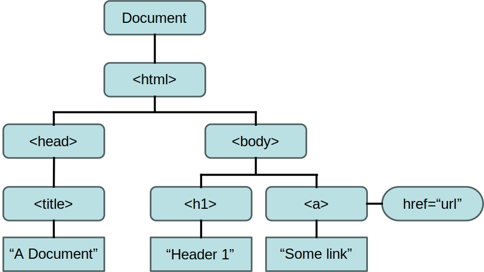

The Document Object Model (DOM) is an in-memory tree structure that represents the HTML of a web page.

Simply put, the DOM allows you to:

* Locate certain HTML elements (e.g. a `<div>` with a certain *id* or *class*)
* Do things to those elements (e.g. change content, change styles, delete, etc.)

## A Web Page as a Tree

Consider this page:
```html
<!DOCTYPE html>
<html>
    <head>
        <title>A Document</title>
    </head>
    <body>
        <h1>Header 1</h1>
        <a href="url">Some link</a>
    </body>
</html>
```

When loaded into the browser it results in a DOM tree like this:



## Setup

Create a simple HTML page like this:

```html
<!DOCTYPE html>
<html>
    <head>
        <title>JavaScript DOM Demo</title>
    </head>
    <body>
        <h1>JavaScript DOM Demo</h1>
        <main>
            <p id="p1"></p>
        </main>
        <script>
            
        </script>
    </body>    
</html>
```

## Accessing Elements by ID

Add the following to the `<script>` element at the bottom of the page:

```js
document.getElementById("p1").textContent = "Hello, world!";
```

_Open the page in your browser and see how it appears._

The `textContent` *attribute* is the plain text of an element. In contrast, `innerHTML` contains formatted HTML.

Change the previous code to this:

```js
document.getElementById("p1").innerHTML =
  "Click this <a href='http://byu.edu'>Link</a>.";
```

_Refresh the page in your browser and see how it appears._

## Accessing Elements by Class

Accessing elements by class is a little different than by ID. That's because more than one element may have the same class.

Add some text with empty spans to the `<main>` element like this.

```html
<p>
    My favorite foods are
    <span class='num'></span> Pizza,
    <span class='num'></span> Ice Cream, and
    <span class='num'></span> Tacos.
</p>
```

Then add the following to the script portion:

```js
// The braces are just to limit the scope of _counter_
{
    let counter = 1;
    for (const num of document.getElementsByClassName("num")) {
        num.textContent = counter + ".";
        ++counter;
    }
}
```

_Refresh the page in your browser and see how it appears._

Notice that when the `+` operator is used with a string, it automatically converts `counter` to a string and then concatenates the other string.

## Accessing Elements by Tag Name

Add an empty list the `<main>` element of your page like this:

```html
<ul>
    <li>Shoes</li>
    <li>Socks</li>
    <li>Shirt</li>
</ul>
```
Then add the following to the `<script>` element:

```js
for (const li of document.getElementsByTagName("li")) {
    li.textContent += " required.";
}
```

_Refresh the page in your browser and see how it appears._

Of course, sometimes you just want the first instance, or maybe there's only one of the element you care about. So, just pick the zero index of the array.

```js
document.getElementsByTagName("h1")[0].style.fontStyle = "italic";
```

_Refresh the page in your browser and see how it appears._

## Accessing Elements with a CSS Selector

`document.querySelector()` and `document.querySelectorAll()` work much like the "getElement" methods. However, they use CSS selectors instead of id, class name, or tag name. `querySelector()` returns the first element in the HTML document that matches the CSS selector passed to it while `querySelectorAll()` returns an array of all matching elements.

Add the following to the `script` element:

```js
for (const ele of document.querySelectorAll("span.num")) {
    ele.style.backgroundColor = "Aquamarine";
}
```

_Refresh the page in your browser and see how it appears. (You probably figured this out by now.)_

## Adding New Elements to the DOM

You can use innerHTML to add full html markup, but many times it's easier and it's always safer to create the elements in code.

> Using innerHTML without caution can make your page vulnerable to [Cross Site Scripting (XSS)](https://owasp.org/www-community/attacks/xss/) attacks which we will discuss later in the semester.

Add the following to your `<script>` element and refresh.

```js
{
    let footer = document.createElement("footer");
    footer.innerText = "The end.";
    footer.style.fontWeight = "bold";
    document.body.appendChild(footer);
}
```

## Some Useful HTML DOM Properties

* x.innerHTML - the HTML value of x
* x.textContent - the plain text value of x
* x.tagName - the tag name of an element
* x.parentNode - the parent of a node
* x.childNodes - the collection of child nodes
* x.attributes - the collection of attributes of an element

## Some Useful HTML DOM Methods
* x.getElementById(id)
* x.getElementsByTagName(name)
* x.getElementsByClassName(names)
* x.appendChild(element)
* x.removeChild(element)